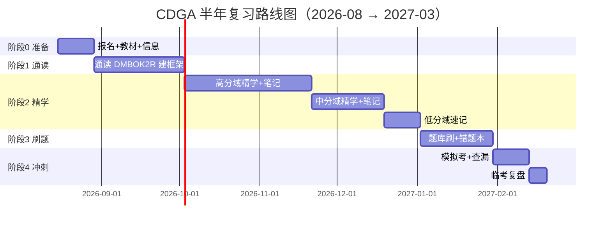

# DAMA-CDGA 数据治理工程师 · 半年长线复习规划

> **结论先行**：CDGA 是 DAMA 中国颁发的「数据治理工程师」认证——线下笔试、100 道中文单选、60 分及格、100 分钟。
> 官方教材为《DAMA 数据管理知识体系指南（第二版修订版）》（简称 **DMBOK2R**）。
> **你的最大优势**：你正在做的 datalake-etl 项目（Doris DWS/ODS 层、户号↔合同 mapping、数据质量根因分析）几乎覆盖了考纲里近 2/3 的知识域。本规划把你的项目经验直接当作「活案例库」来用，理解理论会快很多，不用死记硬背。

---

## 一、考试全貌（速览）

| 项目 | 内容 |
|------|------|
| 证书全称 | Certified Data Governance Associate（CDGA，数据治理工程师） |
| 发证机构 | DAMA 中国 |
| 考试形式 | 线下笔试，全中文 |
| 题型 / 题量 | 100 道单选题，每题 1 分 |
| 满分 / 及格 | 100 分 / **60 分**及格（另有「各章不低于 40%」的潜规则，见第八节） |
| 考试时长 | 100 分钟（平均每题 1 分钟，节奏紧） |
| 教材 | 《DAMA 数据管理知识体系指南（第二版修订版）》DMBOK2R（2025.6 起启用，过渡期旧版也可） |
| 报名费 | 约 1000 元/人 |
| 考试频次 | 一年 4 次（3 月、6 月、9 月、12 月，多为当月最后一个周末） |
| 考点 | 北上广深等，单城报名满 25 人开考 |
| 续证 | 每 3 年需累计 60 学分，续证费 200 元 |
| 报名通道 | DAMA 中国官网 / 「MyDAMA」公众号 / 授权培训机构 |

> ⚠️ 考试时间与细则以 DAMA 中国当年官方通知为准，报名前务必核对最新大纲与教材版本。

---

## 二、17 个知识领域与分值权重（按投入优先级分三档）

> 不同机构给出的单章分值略有出入，下方按「高 / 中 / 低」三档归类，并标注**建议复习投入占比**（合计 100%）。抓高丢低是误区——低分章也要保底到 40%（见第八节）。

| 档位 | 知识领域 | 约占比 | 你的实战关联度 |
|------|----------|--------|----------------|
| 🔴 高（必拿，各约 8–10 分） | 数据治理 | 10% | ★★★ 你做的 mapping 治理、monitor 覆盖策略就是治理落地 |
| | 数据质量 | 10% | ★★★ 重复合同、源错 1507→48624、ODS 同步延迟根因分析 |
| | 元数据管理 | 10% | ★★ 字段释义、血缘（EPK→ODS→DWS） |
| | 数据仓库与商务智能 | 10% | ★★★ ODS/DWS 分层、DSS 合同客户表 |
| | 参考数据和主数据管理 | 10% | ★★★ 户号↔合同映射本质就是主数据管理 |
| | 数据建模与设计 | 8% | ★★★ DWS 层表结构设计、维度建模 |
| 🟡 中（6–8 分） | 数据架构 | 6% | ★★ 企业数据模型、数据流（EPK→ODS→DWS） |
| | 数据安全 | 8–10% | ★★ 数据分类分级、脱敏 |
| | 大数据和数据科学 | 8–9% | ★ 国网 15 分钟账单属时序/大数据范畴 |
| | 数据管理成熟度评估 | 4–6% | ★ 治理成熟度自查可用 |
| 🟢 低（2–4 分，保底） | 数据管理（概述） | 4% | ★ |
| | 数据处理伦理 | 2% | ★ |
| | 数据存储与操作 | 2% | ★ Doris/MySQL 运维经验 |
| | 数据集成与互操作 | 2% | ★★★ ETL 同步、ODS 同步延迟正是此域 |
| | 文件和内容管理 | 2% | ★ |
| | 数据管理组织与角色期望 | 2% | ★ 数据管家/治理委员会角色 |
| | 数据管理和组织变革管理 | 2% | ★ |

**建议投入时间比例**：高 55% · 中 30% · 低 15%（低分章用「概念速记」方式覆盖，不深抠）。

---

## 三、拿分基本盘（关键发现，优先打透）

1. **五大高地**（合计约 50+ 分）：数据治理、数据质量、元数据管理、数据仓库与 BI、参考/主数据。这五块是及格生命线，务必逐章做笔记+刷题。
2. **数据质量六维度年年必考**：完整性、准确性、一致性、唯一性、及时性、有效性——必须能区分定义与适用场景。
3. **最高频混淆点**：
   - 数据治理 vs 数据管理：治理是「决策与监督」，管理是「执行层活动」，治理 ⊂ 管理。
   - 数据架构 vs 数据建模：架构是「顶层设计蓝图」，建模是「具体实现」。
   - ETL vs ELT、维度建模 vs 三范式建模的适用场景。
4. **你的实战即答案**：遇到「场景题」，直接用你项目里的真实做法反推——比如「账户存在性校验需交叉核对当日与历史数据」就是数据质量「一致性/完整性」原则的体现。

---

## 四、半年长线复习路径总览（26 周基准，目标 2027 年 3 月场次）

| 阶段 | 时间窗 | 目标 | 关键产出 |
|------|--------|------|----------|
| 阶段 0 | 第 1–2 周 | 锁定场次、备齐资料 | 教材到手、报名意向、复习主页建好 |
| 阶段 1 | 第 3–7 周 | 通读全书，建立 17 域框架 | 知识域思维导图、术语表 |
| 阶段 2 | 第 8–20 周 | 分域精学，高分域优先 | 每域笔记 + 实战映射卡 |
| 阶段 3 | 第 21–24 周 | 刷题库、建错题本 | 错题本、薄弱域清单 |
| 阶段 4 | 第 25–26 周 | 模拟考、查漏补缺 | 2 套模拟成绩 ≥75、冲刺笔记 |

> 若想提前到 **2026 年 12 月**场次，把阶段 2/3 压缩 1/3 即可（你已有实战底子，压缩可行）。

---

## 五、分月执行计划

### 第 1 月（8 月）：启动 + 通读
- 买 DMBOK2R，关注「MyDAMA」公众号，确定报考场次。
- 通读第 1–2 遍，不求懂，只画「17 域思维导图」+ 整理术语表（治理/管理/架构/建模等易混词先单列）。
- 用 GitLab Pages 建一个复习主页（契合你「网页交付」偏好），把导图和术语表挂上去。

### 第 2 月（9 月）：高分域第一轮
- 精学顺序：**数据治理 → 数据质量 → 数据仓库与 BI → 参考/主数据 → 元数据管理 → 数据建模与设计**。
- 每章输出一页「核心考点卡」（定义 + 原则 + 你的项目对应案例）。
- 周末自测：合书能口述该章框架。

### 第 3 月（10 月）：高分域深化 + 中分域
- 高分域二刷（做章节题），中分域精学：**数据架构、数据安全、大数据和数据科学、成熟度评估**。
- 把「户号↔合同 mapping」「ODS 同步延迟根因」写成标准案例，对应主数据/数据集成/数据质量。

### 第 4 月（11 月）：低分域速记 + 全量回顾
- 7 个低分域用「概念速记法」过一遍（定义+1 句话记忆点）。
- 全量回顾思维导图，标记模糊点。

### 第 5 月（12 月）：刷题 + 错题本
- 集中刷真题/模拟题，按域统计正确率。
- 正确率 <70% 的域回炉精学；建错题本（错因+对应知识域+正确逻辑）。

### 第 6 月（次年 1–2 月）：冲刺
- 每周 1 套模拟考，限时 100 分钟，目标 ≥75 分。
- 专攻易混点（治理/管理、架构/建模、ETL/ELT）。
- 临考前 2 周：只看错题本 + 冲刺笔记 + 术语表。

---

## 六、把你的项目经验变成考点（个性化映射，本规划核心）

| 你的实际工作 | 对应 CDGA 知识域 | 可直接复用的「活案例」 |
|--------------|------------------|------------------------|
| Doris ODS / DWS 分层、DSS 合同客户表 | 数据仓库与 BI、数据架构 | 分层架构设计、数据集市/宽表思路 |
| 户号 ↔ 合同 mapping（创力/英豪异常） | 参考数据和主数据管理 | MDM 识别、主数据错误（customer_id 1507→48624）治理 |
| 重复合同记录分析、源数据错误识别 | 数据质量 | 六维度（一致性/准确性）实战、根因分析流程 |
| ODS 同步延迟导致创力匹配异常 | 数据集成与互操作 | ETL 同步、数据时效性与及时性维度 |
| EPK(MySQL) → ODS → DWS 数据流 | 元数据管理、数据架构 | 血缘分析、企业数据模型、数据流图 |
| 账户存在性需交叉核对当日与历史 | 数据质量（完整性/一致性） | 校验规则设计原则 |
| 售电公司户号/新户号特殊实体标注 | 数据治理、主数据 | 主数据分类、治理策略落地 |
| GitLab Pages 交付查询结果 | 文件和内容管理（延伸） | 非结构化/成果交付治理思路 |

> 💡 用法：每学一个知识域，先想「我项目里哪块对应」，把理论套进真实场景，记忆牢固度远胜死背。

---

## 七、资料清单与工具

**必备**
- 《DAMA 数据管理知识体系指南（第二版修订版）》— 官方教材，唯一权威源。
- DAMA 中国官方大纲 / 样题（报名后通常发放）。

**辅助（按需）**
- 各机构 CDGA 题库 / 真题汇编（注意甄别，以教材为准绳）。
- 「MyDAMA」公众号、DAMA 中国社群（答疑、报名提醒）。
- 复习主页：GitLab Pages（把导图、术语表、错题本挂成网页，自动更新+git 提交，契合你的工作流）。

**笔记法**
- 每域一页「核心考点卡」：定义 + 原则/框架 + 1 个你的项目案例 + 易混点。
- 全局「术语对照表」：治理/管理、架构/建模、ETL/ELT 等成对词集中对比。

---

## 八、避坑与高频失分点

1. **别放弃任何章节**：考试有「各章得分不低于 40%」的潜规则，低分章也要保底过关，否则总分够也挂。
2. **治理 ⊂ 管理，不是并列**：治理负责决策监督，管理负责执行。
3. **架构是蓝图，建模是图纸**：架构顶层、建模落地，边界题年年有。
4. **数据质量六维度必须能辨析**：给场景要能判断是「准确性」还是「一致性」问题。
5. **新教材已加数据伦理/隐私/AI 伦理**：修订版新增约 10% 相关题，别只看旧版。
6. **刷题以教材为锚**：市面题库可能有误，遇冲突一律回到 DMBOK2R 原文。
7. **时间管理**：100 分钟 100 题，前 30 分钟做定义/原则送分题，中间 40 分钟攻分析题，最后留 10 分钟填卡+复查。

---

## 九、里程碑自检（Checkpoint）

- [ ] **第 2 周末（2026-08-28）**：思维导图完成，能说出 17 域名字。
- [ ] **第 7 周末（2026-10-02）**：通读两遍，术语表成型。
- [ ] **第 13 周末（2026-11-13）**：高分域笔记+案例卡完成，口述流畅。
- [ ] **第 20 周末（2027-01-01）**：中/低分域过完，全量回顾无盲区。
- [ ] **第 24 周末（2027-01-29）**：题库正确率 ≥70%，错题本成型。
- [ ] **考前 2 周（≈2027-03-13 ~ 03-19，视官方场次）**：2 套模拟 ≥75 分，只看错题+术语+冲刺笔记。

---

## 十、本周就做（下一步行动）

1. 下单 DMBOK2R（第二版修订版），确认是「修订版」而非旧版。
2. 微信搜「MyDAMA」关注，进 DAMA 备考群；确定报 **2027 年 3 月**（或 2026 年 12 月）场次。
3. 在 GitLab 建 `cdga-review` 仓库，把本规划 + 思维导图挂成 Pages 主页。
4. 建「17 域术语对照表」第一版（先填治理/管理、架构/建模、ETL/ELT）。
5. 把「户号↔合同 mapping」「ODS 同步延迟」写成第一张主数据/数据集成案例卡。

---
> 文档版本：v1 · 生成日期 2026-08-13 · 基于 DAMA 中国 CDGA 公开考纲与 DMBOK2R 整理，考试细则以官方最新通知为准。
