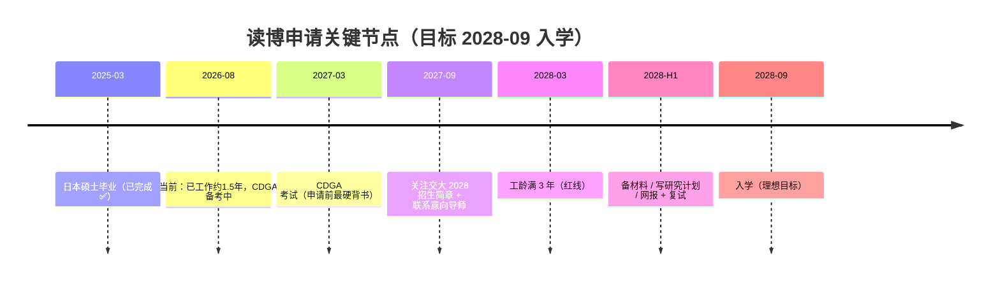

# 上海交通大学在职博士申请计划（数据治理 / 电力数据方向 · 修正版 v2）

> **🔴 关键修正**：硕士已于 **2025-03 在日本毕业（非 2028）**。因此你的工龄时钟早已启动——到今天（2026-08）已工作约 **1.5 年**，3 年工龄红线在 **2028-03**，最理想入学节点就是 **2028-09**（满 3 年次月即入学）。本计划按此重写，并把"日本硕士需做国外学历认证"补进去。
>
> **结论先行**：你剩下约 **1.5 年（2026-08 ~ 2028-03）** 的积累窗口就要撞工龄红线，比原计划的 3 年紧一倍。但 **2028-09 入学就是最理想、最自然的目标**——按最常见「入学前满 3 年」口径，你 2028-09 时已有 3.5 年工龄，稳过；即便按「复试前满 3 年」（2028 春）你 2028-03 也已满，同样过。仅"报名时满 3 年且注册早于 2028-03"的窄情形才需顺延 2029。CDGA（2027-03）正好卡在申请前一年，是申请前能拿到的最硬背书。动作分两段：**现在到 2028-03** 攒项目/论文/人脉/单位支持 + 拿 CDGA；**2027 下半年起**盯简章、联系导师、写研究计划。
>
> ⚠️ 所有年限/名额/方向以**申请当年上海交大博士招生简章**为准，本文件为基于近年规则的规划框架，非承诺。
>
> 🔴 **跨学科报考重大约束（艺术类硕士 → 数据治理博士）**：你的硕士是**艺术类**，与目标博士（数据治理/电力数据）不在同一学科。但上海交大**非全日制工程博士**的学科门槛是"获硕士或学士学位专业须至少一个为理工科"——**✅ 已确认你的本科为理工科，该门槛满足，工程博士路线成立**（艺术类硕士不构成障碍）。若未来换目标院校，仍需核对对方学科要求。推荐信"须含硕士导师"的硬要求对工程博士同样适用，不受影响。

---

## 一、时间线倒推（关键里程碑 · 修正后）

| 节点 | 时间 | 关键交付 |
|------|------|----------|
| 日本硕士毕业 | 2025-03 | ✅ 已完成，需补**国外学历认证** |
| 工龄满 3 年 | 2028-03 | 满足多数非全博士工作年限门槛（红线） |
| CDGA 拿下 | 2027-03 | 数据治理权威证书，申请前最强背书 |
| 简章发布 | 约 2027-09 | 确认当年院系/方向/名额/年限口径 |
| 材料提交 | 2027 末~2028 初 | 研究计划、推荐信、单位同意证明、学历认证 |
| 入学 | 2028-09（理想目标） | 非全日制博士在读 |

> ⚠️ **年限口径（唯一不确定项）**：非全博士常要求"硕士毕业后工作满 3 年"。**理想且最自然的目标就是 2028-09 入学**——按最常见的「入学前满 3 年」口径，你 2028-09 时已有 3.5 年工龄，稳过；即便按「复试前满 3 年」（2028 春），你 2028-03 也已满，同样过。只有极端情形——简章写「**报名时**满 3 年」且网报窗口早于 2028-03 开启——才可能差一两个月，届时顺延 **2029 入学** 即可。这一点务必在 2027 看简章时第一时间核对口径，但默认按 **2028-09** 排。

---

## 二、常见报考资格（以当年简章为准）

| 项目 | 常见要求 | 你的现状/对策 |
|------|----------|----------------|
| 学位 | 已获硕士学位 | 2025-03 日本取得，✅（需补**教育部留学服务中心学历认证**） |
| 工作年限 | 非全工程博士多要求硕士毕业后 2–5 年相关经验 | 2028-03 满 3 年，基本覆盖；以当年口径为准 |
| 年龄 | 多数 ≤45 周岁 | 远未到，✅ |
| 专家推荐信 | 2 位副教授（或相当）以上专家 | **仅剩 ~1.5 年窗口**，需尽快积累人脉（2027 前锁定 2 人） |
| 单位同意 | 在职攻读需单位人事部门出具同意证明 | 现在就经营领导关系，提前沟通读博意向 |
| 外语 | CET-6 或相当（雅思/托福可替代） | 保持/补强，必要时考雅思 |
| 科研成果 | 部分要求论文/专利/突出成果 | 窗口紧，2027 内至少出 1 篇论文/专利/软著（**跨专业更需突出成果补强**） |
| 学历认证 | 国外学位须经 CSCSE 认证 | **尽早办**（见第八节新增任务） |
| 学科背景（工程博士硬门槛） | 非全工程博士要求"硕士或学士至少一个为理工科" | ✅ **本科为理工科，已满足**（艺术类硕士不构成障碍） |

---

## 三、上海交大对口专业方向（结合你的行业）

> 你的行业背景：电力系统数据治理（datalake-etl、Doris DWS/ODS、户号↔合同主数据、国网账单、售电营销数据）。下表按匹配度排，最终以当年招生专业目录为准。

| 院系 | 可能的非全博士方向 | 与你的匹配点 | 匹配度 |
|------|--------------------|--------------|--------|
| 电子信息与电气工程学院 | 电气工程（能源互联网/电力系统大数据）、计算机（数据管理/知识工程） | 电力数据、主数据治理、DWS 建模直接相关 | ★★★ |
| 安泰经济与管理学院 | 管理科学与工程（信息系统/数据治理）、DBA（工商管理博士） | 数据治理方法论、管理视角，DBA 偏高管 | ★★★ |
| 机械与动力工程学院 | 工业工程（智能制造/大数据） | 若岗位偏制造/工业互联网数据 | ★★ |
| 上海高级金融学院（SAIF） | 金融学/DBA（金融数据方向） | 若走售电/金融数据路线 | ★★ |
| 媒体与传播/其他 | 数据治理交叉 | 一般 | ★ |

> 💡 选向建议（已确认本科理工科，路线锁定）：**非全日制工程博士**为首选路径——"硕士或学士至少一个理工科"门槛已由本科满足。首选 **电院 电子信息(085400)/电气工程(085801)/能源动力(085800)** 工程博士，最贴你 datalake-etl 工程技术实践；**安泰管科/DBA** 作备选（看管理/数据治理契合）。艺术类硕士不再构成障碍。

---

## 四、剩余积累窗口（2026-08 ~ 2028-03，约 1.5 年 · 压缩版）

> 原"三年积累期"因硕士已毕业而压缩为 **约 19 个月**。每阶段目标必须前置，不能等。

| 阶段 | 时间 | 核心目标 | 具体动作 |
|------|------|----------|----------|
| A 起步 | 2026 H2（现在~12） | 定方向 + 经营单位 + 认证 | 跟直属领导铺垫读博意向；启动**国外学历认证**；明确岗位是否数据治理类；CDGA 冲刺（2027-03） |
| B 筑基 | 2027 全年 | 证书 + 项目 + 人脉 | CDGA 到手；主导 1 个数据治理落地项目（可写进研究计划）；考 CDGP（专家级）；结识 2 位可写推荐信的专家 |
| C 冲刺 | 2028 H1 | 成果 + 材料 + 申请 | 发 1 篇论文/专利/软著；9 月起（实际 2027-09 起）盯 2028 简章；联系导师、写研究计划书；备齐材料网报+复试；9 月入学（目标 2028-09） |

**研究计划书（Proposal）是录取关键**：建议方向「面向电力系统的数据治理框架 / 主数据管理与数据质量保障」，直接复用你 datalake-etl 的真实案例（户号↔合同、ODS 同步延迟根因、重复合同治理）——这些实战经验面试能讲出细节。

---

## 五、申请材料清单（申请当年）

- [ ] 博士研究生报名表（网报生成）
- [ ] **国外学历学位认证书（CSCSE 出具）** ← 日本硕士新增必需项
- [ ] 硕士学位证、硕士毕业证、本科证照（复印件+核验）
- [ ] 硕士成绩单、硕士学位论文
- [ ] 单位人事部门同意报考证明（在职攻读必备）
- [ ] 两位专家推荐信（副教授以上）
- [ ] 研究计划书 / 攻读博士科学研究计划
- [ ] 外语水平证明（CET-6 / 雅思 / 托福）
- [ ] 科研成果（论文、专利、软著、项目证明）
- [ ] 个人陈述 / 简历 / 政审表 / 体检表
- [ ] CDGA / CDGP 等职业资格证书（加分项）

> 📌 **交大官方口径补充（据 2026 年招生简章及设计/国务/外国语/教育/体育等院系通知核实）**：
> - **硕士成绩单：必交**。须"毕业院校正式成绩单（加盖公章）"；境外硕士提交原件，部分院系要求附**中文翻译/公证**，以当年简章为准。
> - **硕士学位论文：必交，且你属"非应届"须上传整本论文**（应届生才可用摘要+目录替代）。日文论文建议另附**中文摘要/概要**。
> - **推荐信硬约束**：至少 2 位副教授以上专家，且**其中 1 位须为你的硕士导师**（通过系统提交）。请尽早确认能否联系到日本硕士导师——这是材料准备里最该提前锁的一项。
> - 境外硕士另须 **CSCSE 国外学历学位认证书**（见上）；外语证明接受「日本语能力测试一级 N1」，日文背景可为优势。

> ⚠️ **两个常见误区澄清（2026 简章核实）**：
> - **工作论文不能替代硕士学位论文**。硕士学位论文是你拿日本硕士时必须提交的学位论文（整本），属强制材料；工作中写的期刊/技术论文归到**「科研成果」**类别单独提交，是加分项但不替代论文。务必找回日本硕士论文原件（建议配中文摘要）。
> - **推荐信不能全靠校企合作老师**。SJTU 明文要求 2 位副教授以上推荐人中**至少 1 位须为你的硕士导师**；另一位才可用校企合作项目认识的老师（须副教授以上、同领域）。故日本硕士导师那封必须尽早锁定，校企合作老师是"第二封"最佳人选，而非全部。

### 五·B 推荐信实战策略：如何搞定日本硕士导师（含失联兜底）🔴

> **硬规则（已据电院/人工智能/智慧能源/机械/设计 5 院系 2026 简章核实，措辞一致）**：
> "至少两名所报考学科专业领域内副教授以上职称（或相当专业技术职称）专家提供的推荐信，**其中一名推荐人须为考生硕士导师**；所有推荐信须由推荐专家通过系统提交。"

**1）本科院长能不能替代硕士导师？——不能。**
本科院长（若为副教授以上/院长多为教授）可以当**第 2 封甚至第 3 封**推荐人，是加分项；但他**不是你的硕士导师**，无法替代那封硬要求。同理，校企合作老师也只能当"第二封"。**硕士导师那封是写进简章的刚需，无可替代。**

**2）为什么艺术类硕士导师的信也"够格"？**
规则要的是"硕士导师"这一**身份来源**（证明你受过系统科研训练、具备研究能力与人品），并不要求导师专业与报考方向一致。艺术类教授完全可以为你出具"学习态度严谨、具备独立研究能力、可攻读博士"的背书——它补足的是"学术潜力证明"，真正的工程能力由第 2 封（校企老师/本科院长）+ 科研成果体现。**所以别因为"他是艺术教授"就觉得这封信没用，它恰恰是你材料链里不可或缺的合规一环。**

**3）导师三年不理你——最现实的破解法：现在就开始"续旧"，别等 2028 才敲门。**
你还有 **2026→2028 整整 2 年窗口**，冷启动变热关系完全来得及：
- **2026 现在（第一步，最该做）**：发一封"好久不见"的续旧邮件——**先不提推荐信**，只汇报近况：毕业后的工作（datalake-etl 数据治理）、正在考 CDGA、未来想往数据治理博士深造。附上你的中文简历。目的只是"重新出现在他视野里"。
- **让对方省力**：同步发一份你写的**研究计划书初稿 / 工作成果小结**，告诉他"以后若需要推荐材料，我可以先起草好供您修改"——海外导师普遍接受学生代拟、其审核提交，这是惯例不是冒犯。
- **多通道保联**：邮箱 + LinkedIn + 通过日本母校院系行政要新联系方式，至少留 2 条路。
- **2027 软性铺垫**：借"选校/研究方向"请教一次，自然带出"计划申请交大工程博士，希望届时能请您推荐"。
- **2028 正式请托**：网报时由系统在系统里发信给他，他点链接提交即可（无需纸质）。
- **关键心态**：导师对学生"毕业多年后仍想深造"通常乐见其成，只要关系没破裂、你主动且有礼貌，成功率很高。**真正危险的是拖到截止前才联系。**

**4）万一真的彻底失联（退休无联络/关系破裂/身故）——兜底路径（非保证，须提前确认）：**
- **提前（2027）书面咨询目标院系研招办**：说明"硕士导师确无法联系"，询问是否接受**例外处理**（情况说明 + 证据 + 改用同领域资深专家替代）。交大规则是硬的，**任何替代都必须拿到该院系书面/邮件确认，不能自己默认可替**。
- **准备"情况说明"材料包**：历次联系邮件截图（含日期）、对方无回复证明、拟替代推荐人的预同意函（须副教授以上、同领域，如本科院长/校企博导）。
- **本科院长在此情形下可作强力补充推荐人，但仍不解除"硕士导师"法定要求**——最终能否豁免取决于院系裁量，务必早问、留证。
- ⚠️ 不要赌"系统不查"：简章明写"材料不实一经查实取消资格"，失联就老实走例外通道，别伪造。

**推荐人最优组合（在你场景）**：① 日本硕士导师（刚需，现在续旧）＋ ② 校企合作博导/教授（工程能力背书）＋〔可选③ 本科院长（副教授以上，增信）〕。

---

## 六、与 CDGA 备考的协同

- **CDGA（2027-03）** 是数据治理领域权威证书，等于提前给你的读博研究计划盖了"专业方向"章，申请时直接加分——且正好卡在申请前一年。
- 工作期可续考 **CDGP（数据治理专家）**、**CDAM（数据资产管理师）**，形成"数据治理证书链"，强化导师对你专业深度的判断。
- 你正在写的 `cdga-review` 复习主页、案例卡，本身就是读博研究计划的素材库——数据质量根因、主数据治理这些真实经验，读博面试能讲出细节。

---

## 七、风险与注意事项

1. **年限口径（唯一不确定项）**：默认目标 2028-09 入学；按"入学前/复试前满 3 年"口径稳过，仅"报名时满 3 年 + 早注册"窄情形顺延 2029（见第一节）。
2. **窗口极紧**：仅 ~1.5 年攒项目/论文/人脉，所有动作必须前置，不能拖。
3. **国外学历认证**：日本硕士须先过 CSCSE 认证才能用于国内报考，办理有周期，尽早启动。
4. **硕士导师推荐信是"握在别人手里"的硬材料**：规则（5 院系一致）要求 2 封副教授以上推荐人中**至少 1 封须为硕士导师**，本科院长/校企老师均不可替代。日本导师若三年不联络可能冷淡——**现在（2026）就开始续旧关系**，别等 2028 才敲门；若彻底失联须 2027 提前向院系研招办申请例外（非保证）。
4. **非全名额少、竞争大**：交大非全博士招生规模有限，务必提前 1 年联系导师、对齐方向。
5. **单位支持是前提**：在职读博要单位同意+时间+可能学费支持，现在就经营好这层关系。
6. **英语不能丢**：CET-6 若过期或不够，提前考雅思/托福补。
7. **研究计划定生死**：申请-考核制下，材料与面试重于统考，Proposal 质量决定成败。
8. **简章年年变**：2027 看当年简章，本文件所有"常见要求"以官方为准。

---

## 八、分阶段行动清单

**现在 ~ 2026-12（起步）**
- [ ] 跟直属领导铺垫读博意向，摸清公司博士政策/学费支持
- [ ] **启动日本硕士的 CSCSE 国外学历学位认证**（官网申请，预留办理周期）
- [ ] ✅ 本科为理工科已确认，工程博士学科门槛满足（跨专业障碍解除）
- [ ] 🔴 **现在就给日本硕士导师发"续旧邮件"**（不提推荐信，只汇报近况+附简历；多留 1 条备用联系方式）——这是整条路里唯一还"握在别人手里"的硬材料，越晚越被动
- [ ] 确认岗位是否明确"数据治理/数据管理"类（决定选院）
- [ ] 以论文/专利/软著沉淀数据治理方向研究成果（跨专业最硬补强）
- [ ] 2027-03 拿下 CDGA
- [ ] 关注交大非全博士往年简章，建立认知

**2027（筑基）**
- [ ] CDGA 到手；续考 CDGP
- [ ] 主导 1 个可写进研究计划的数据治理项目
- [ ] 结识 2 位可出具推荐信的专家（副教授以上）
- [ ] 9 月起盯交大 2028 招生简章，核对**年限口径/方向/名额**
- [ ] 联系意向导师，启动研究计划书

**2028 H1（冲刺）**
- [ ] 出 1 篇论文/专利/软著
- [ ] 备齐材料（含学历认证、单位同意证明、推荐信）
- [ ] 网报 + 材料审核 + 复试
- [ ] 9 月入学（目标 2028-09；仅窄口径情形顺延 2029）

---

## 九、待你确认项（填了更精准 · 本科理工科已确认，余下待确认）

- ✅ **本科专业已确认为理工科**：满足工程博士"硕士或学士至少一个理工科"门槛，路线成立（艺术类硕士不构成障碍）。
- 实际入职日期（决定 3 年工龄红线精确月份 → 2028 还是 2029 入学）
- 国外学历认证是否已办理？（没办要尽快）
- 当前单位是否属"国家重点行业企业/重点研发机构"？（工程博士偏好此类来源）
- 能否以"主持/核心"身份列名 datalake-etl 相关工程项目？（工程博士要求主持承担过工程技术项目）
- 公司是否有博士学费报销/在职读博支持政策？（决定现在就经营）
- 交大非全博士的"工作年限"硬指标几年？（本计划按你所说 3 年排）

---

> 修正日期 2026-08-14（v2）· 初版误按 2028 硕士毕业排，已据「2025-03 日本硕士毕业」更正并压缩时间线 · 目标入学 **2028-09**（最理想节点，2029 仅窄口径兜底）· 规划框架基于近年上海交大博士招生常见规则，所有年限/方向/名额以申请当年官方简章为准
